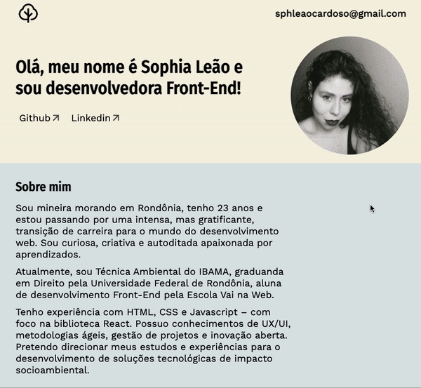

 

# Portfólio

## 
Alura Challenge | Oracle One | Challenge Front-End | <a href="https://www.alura.com.br/challenges/oracle-one-front-end/sprint01-do-figma-ao-html-e-css">Sprint 01 - Do Figma ao HTML e CSS </a>

  
  
  

---

Esse projeto foi desenvolvido no escopo da formação da trilha **<u>Front-End</u>**, idealizada pela Alura em parceria com a Oracle para o programa ONE - Oracle Next Education.

---

## Proposta

O desafio consiste na criação de um portfólio simples para fixação dos conhecimentos sobre HTML5 e CSS3. Como diferencial e para melhor performance, fiz o projeto em React.js.

---

## PREVIEW

### Versão destktop

 
  

### Versão tablet

 
   

### Versão mobile

  

